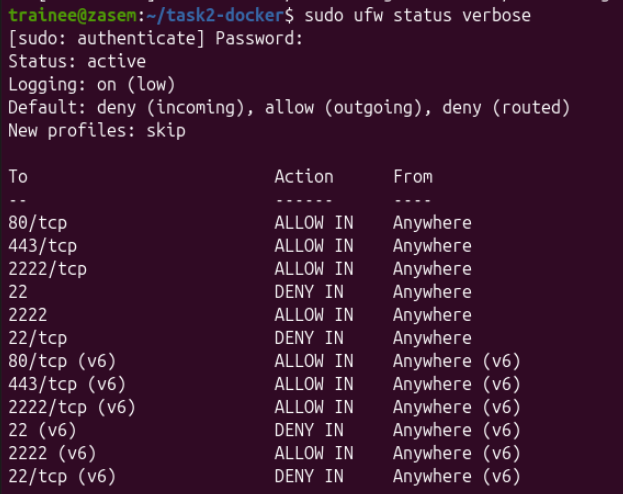
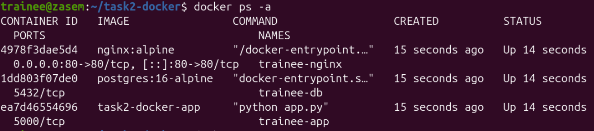
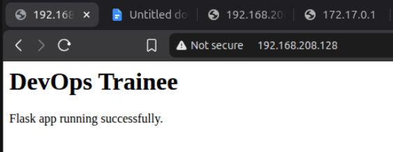
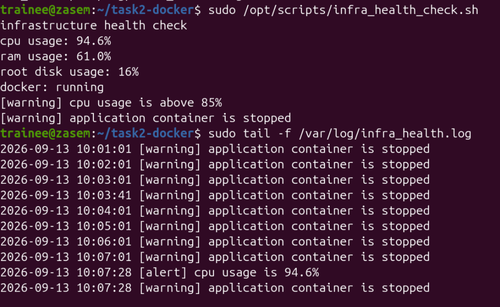

# IT infrastructure and Devops trainee assignment documentation

This repository contains my practical implementation of Linux system administration, containerization, automation, monitoring, database backup and disaster recovery tasks. The work was completed in an Ubuntu environment using tools and technologies such as SSH, UFW, Docker, Docker Compose, Nginx, Flask, PostgreSQL, Bash, Cron, Prometheus and Node Exporter.

Each task documents the configuration process, commands used, testing, troubleshooting and final results. The purpose of this repository is to demonstrate my practical understanding of basic DevOps and system administration workflows through hands on implementation.

# Task 1: System Provisioning & Linux Administration

## 1.1 Ubuntu VM Setup

For this task, I installed the latest Ubuntu version in VMware. During the VM setup, I allocated the required disk space, RAM and CPU resources.

While installing Ubuntu, I created the first user named `zasem`.

After the installation was completed, I opened the terminal and first updated the package list and upgraded the installed packages.

```bash
sudo apt update
sudo apt upgrade -y
```

I did this to make sure the system had the latest package information, security updates and bug fixes before starting the main configuration.

I also checked the Ubuntu version using:

```bash
cat /etc/os-release
```

Then I checked the IP address of the VM using:

```bash
hostname -I
```

I checked the IP address because I needed it later for SSH connection and testing from another Ubuntu VM.

---

## 1.2 Creating the `trainee` User

As required in the assignment, I created a separate user named `trainee`.

```bash
sudo adduser trainee
```

During this process, I created a password for the user and completed the required user details.

After creating the user, I added `trainee` to the sudo group:

```bash
sudo usermod -aG sudo trainee
```

Then I checked the groups of the user:

```bash
groups trainee
```

The output showed that `trainee` was also a member of the `sudo` group.

After that, I switched to the new user:

```bash
su - trainee
```

To confirm that sudo permission was working properly, I ran:

```bash
sudo whoami
```

The output was:

```text
root
```

This confirmed that the `trainee` user could run administrative commands using sudo.

---

## 1.3 Installing and Checking SSH

Before making any SSH changes, I checked whether the SSH service was already available:

```bash
sudo systemctl status ssh
```

The service was not available, so I installed the OpenSSH server:

```bash
sudo apt install openssh-server -y
```

After installation, I started the SSH service:

```bash
sudo systemctl start ssh
```

I also enabled it so that SSH starts automatically after the VM is restarted:

```bash
sudo systemctl enable ssh
```

Then I checked the SSH service again:

```bash
sudo systemctl status ssh
```

After this, the SSH service was running successfully.

---

## 1.4 Changing SSH Port and Disabling Root Login

The assignment required SSH to use port `2222` instead of the default port `22`. It also required direct root SSH login to be disabled.

I opened the SSH configuration file:

```bash
sudo nano /etc/ssh/sshd_config
```

I changed the SSH port from:

```text
Port 22
```

to:

```text
Port 2222
```

I also changed:

```text
#PermitRootLogin prohibit-password
```

to:

```text
PermitRootLogin no
```

I made sure that public key authentication was enabled:

```text
PubkeyAuthentication yes
```

After making the changes, I saved the file using:

```text
Ctrl + O
Enter
Ctrl + X
```

Then I restarted the SSH service:

```bash
sudo systemctl restart ssh
```

The main SSH settings used for this task were:

```text
Port 2222
PermitRootLogin no
PubkeyAuthentication yes
```

---

## 1.5 UFW Firewall Configuration

I enabled the Ubuntu firewall using UFW:

```bash
sudo ufw enable
```

Then I allowed only the ports required by the assignment:

```bash
sudo ufw allow 2222/tcp
sudo ufw allow 80/tcp
sudo ufw allow 443/tcp
```

These ports are used for:

```text
2222 - SSH
80   - HTTP
443  - HTTPS
```

The old SSH port `22` was not allowed because SSH was now configured to use port `2222`.

I checked the firewall rules using:

```bash
sudo ufw status verbose
```

This confirmed that UFW was active and the required ports were allowed.

### 1.5.1 Firewall Screenshot



---

## 1.6 Testing SSH Key Authentication

To test SSH key authentication, I created another Ubuntu VM in VMware and named it `ubuntu-connect`.

The purpose of this second VM was only to act as an SSH client so I could test the SSH connection to the main Ubuntu VM.


On `ubuntu-connect`, I generated an SSH key pair:

```bash
ssh-keygen
```

This created two keys:

```text
Private Key
Public Key
```

The private key stayed on the `ubuntu-connect` machine.

I copied the public key to the main Ubuntu VM using SCP. The command was similar to:

```bash
scp -P 2222 ~/.ssh/<public-key>.pub trainee@192.168.208.x:/home/trainee/
```

After the public key was copied to the main Ubuntu VM, I added it to the `authorized_keys` file of the `trainee` user.

First, I created the `.ssh` directory if it was not already available:

```bash
mkdir -p ~/.ssh
```

Then I opened:

```bash
nano ~/.ssh/authorized_keys
```

I added the public key inside this file.

I also set the correct permissions:

```bash
chmod 700 ~/.ssh
chmod 600 ~/.ssh/authorized_keys
```

Finally, from `ubuntu-connect`, I connected to the main Ubuntu VM using the private key and SSH port `2222`:

```bash
ssh -i <my-private-key> -p 2222 trainee@192.168.208.x
```

The SSH connection was established successfully.

---


## 1.7 Task 1 Result

Task 1 was completed successfully. I prepared an Ubuntu VM, created the required `trainee` user with sudo permission, configured SSH on port `2222`, disabled direct root SSH login, tested SSH key authentication from another Ubuntu VM, and configured UFW to allow only the required ports.

---

# Task 2: Containerization & Web Services

## 2.1 Updating the System

Before installing Docker, I updated the Ubuntu system again using:

```bash
sudo apt update
sudo apt upgrade -y
```

I did this to make sure the package list was updated and the system had the latest available packages before installing Docker.

---

## 2.2 Installing Docker and Docker Compose

I checked the Docker documentation for installing Docker on Linux and then installed Docker and Docker Compose using:

```bash
sudo apt install docker.io docker-compose-v2 -y
```

After the installation, I started the Docker service:

```bash
sudo systemctl start docker
```

I also enabled Docker so that it starts automatically after the system restarts:

```bash
sudo systemctl enable docker
```

I checked the Docker service using:

```bash
sudo systemctl status docker
```

To allow the `trainee` user to use Docker without writing `sudo` every time, I added the user to the Docker group:

```bash
sudo usermod -aG docker trainee
```

After this, I logged out and logged in again so the new group permission could be applied.

I checked Docker using:

```bash
docker --version
```

and:

```bash
docker compose version
```

---

## 2.3 Creating the Project Folder

I created a separate folder for Task 2:

```bash
mkdir task2-docker
cd task2-docker
```

Inside this folder, I created the required folders for the Flask application and Nginx configuration:

```bash
mkdir app nginx
```

I also created the Docker Compose file:

```bash
touch docker-compose.yml
```


To make editing the files easier, I installed Visual Studio Code on Ubuntu and used it to write the required configuration and application files.

All the final files used for this task are included in this GitHub repository.

---

## 2.4 Flask Application

Inside the `app` folder, I created the Flask application files.

The Flask application was configured to listen on port `5000`.

The main purpose of this application was to provide a simple web page so that I could test whether the reverse proxy was working correctly.

The Flask application runs inside its own Docker container named:

```text
trainee-app
```

---

## 2.5 Nginx Reverse Proxy

Nginx was configured as a reverse proxy.

It listens on port `80` and forwards the request to the Flask application running on port `5000`.


The main Nginx reverse proxy configuration is also in the github repo inside of default.conf

This the result means that when a user opens:

```text
http://localhost
```

or:

```text
http://192.168.208.x
```

Nginx receives the request on port `80` and sends it to the Flask application on port `5000`.

---

## 2.6 PostgreSQL Database

For the database service, I used PostgreSQL.

PostgreSQL runs inside a separate Docker container named:

```text
trainee-db
```

A persistent Docker volume was attached to the PostgreSQL container.

The purpose of the volume is to keep the database data even if the PostgreSQL container is restarted or recreated.

The volume used in the Docker Compose file is:

```text
postgres_data
```

---

## 2.7 Docker Compose Setup

The `docker-compose.yml` file was used to run all three services together:

```text
1. Nginx
2. Flask Application
3. PostgreSQL
```

After completing the application, Nginx and Docker Compose configuration files, I started the containers using:

```bash
docker compose up -d
```

I checked the running containers using:

```bash
docker ps
```

The expected containers were:

```text
trainee-nginx
trainee-app
trainee-db
```


---

## 2.8 Troubleshooting the Flask Container

During the first run, there was an issue with the `trainee-app` container and it was not running correctly.

I checked the container status and logs using commands such as:

```bash
docker ps -a
```

and:

```bash
docker logs trainee-app
```

I reviewed the error and checked online resources to understand the issue.

After correcting the Flask configuration, I rebuilt and started the containers again.

```bash
docker compose up -d --build
```

After this, all three containers were running successfully.

This troubleshooting helped me understand that checking container logs is one of the first steps when a Docker container is not running properly.

## 2.9 Docker ps screenshot



---

## 2.10 Testing the Reverse Proxy

After all three containers were running, I tested the application from the Ubuntu VM using:

```bash
curl http://localhost
```

The Flask application page was returned successfully.


I also checked the IP address of the Ubuntu VM using:

```bash
hostname -I
```

Then I opened the server IP in a browser:

```text
http://192.168.208.x
```

The Flask application was displayed successfully in the browser.

## 2.11 Browser output sccessing the reverse-proxied application



This confirmed that the Nginx reverse proxy and Flask application were working correctly.

---


## 2.12 Task 2 Result

Task 2 was completed successfully.

I installed Docker and Docker Compose, created the required project folders and configuration files, and deployed three Docker services: Nginx, Flask and PostgreSQL.

Nginx was exposed on host port `80` and configured to forward requests to the Flask application on port `5000`.

PostgreSQL was configured with a persistent Docker volume.

After resolving an issue with the Flask container, all three containers were running successfully. I tested the application using `curl http://localhost` and also opened the Ubuntu server IP in a browser, where the Flask application was displayed correctly.

---

# Task 3: Automation & Shell Scripting

## 3.1 Creating the Health Check Script

For Task 3, I created a Bash script named:

```text
infra_health_check.sh
```

The working script was placed inside:

```text
/opt/scripts/infra_health_check.sh
```

I created and edited the script in this location and added all the required health checks.

After creating the script, I gave it execute permission using:

```bash
sudo chmod +x /opt/scripts/infra_health_check.sh
```

A copy of the same script is also included in this GitHub repository so it can be viewed easily:

[View `infra_health_check.sh`](scripts/infra_health_check.sh)

---

## 3.2 The Script Checks

The script checks the basic health of the Ubuntu server.

It checks:

- CPU usage
- RAM usage
- Root disk usage
- Docker service status
- Web application container status

The script can be run manually using:

```bash
sudo /opt/scripts/infra_health_check.sh
```

A normal output shows the current system usage and whether Docker and the application container are running.

---

## 3.3 Warning Test

To make sure the warning part of the script was working, I tested different failure conditions.

### 3.3.1 Testing the Application Container

I stopped the application container temporarily so that the script could detect that it was not running.

For example:

```bash
docker stop trainee-app
```

Then I ran:

```bash
sudo /opt/scripts/infra_health_check.sh
```

The script showed a warning that the application container had stopped.

After the test, I started the container again:

```bash
docker start trainee-app
```

---

## 3.4 Testing High CPU Usage

I also tested the script with high CPU usage.

For this test, I used a small Python CPU load script to increase CPU usage for a short time.

When CPU usage went above `85%`, the script displayed a warning.

This was an extra test that I used to make sure the warning logic was working properly.

The CPU load was only used for testing and was stopped after the warning was confirmed.

---

## 3.5 Log File

Warnings generated by the script are saved in:

```text
/var/log/infra_health.log
```

The log contains the warning message together with the date and time.

I checked the log using:

```bash
sudo cat /var/log/infra_health.log
```

or:

```bash
sudo tail /var/log/infra_health.log
```

The log showed entries when the application container was stopped and when the warning condition was reached.

## 3.6 Screenshot




This makes it easier to know when a problem happened.

---

## 3.7 Running the Script Automatically with Cron

After testing the script manually, I configured a cron job so that the health check runs automatically every 15 minutes.

I opened the root crontab using:

```bash
sudo crontab -e
```

When the editor selection was shown, I selected option `1` for:

```text
/bin/nano
```

Then I added this line:

```cron
*/15 * * * * /opt/scripts/infra_health_check.sh
```

This means the script runs automatically every 15 minutes.

For example:

```text
10:00
10:15
10:30
10:45
11:00
```

To check the configured cron job, I used:

```bash
sudo crontab -l
```

---
---

## 3.8 Task 3 Result

Task 3 was completed successfully.

I created the `infra_health_check.sh` script under `/opt/scripts/`, gave it execute permission and used it to check CPU, RAM, disk usage, Docker status and the web application container.

I tested the warning function by stopping the application container and also tested high CPU usage. The warning messages were recorded with a timestamp inside `/var/log/infra_health.log`.

Finally, I configured a root cron job to run the script automatically every 15 minutes.

---

# Task 4: Monitoring, Backups & Disaster Recovery

## 4.1 Creating the Database Backup Folder

For the database backup, I first created a separate folder where the backup files would be stored.

The backup location used was:

```text
/var/backups/db/
```

This keeps the database backup files in one fixed location and makes them easy to find when a restore is needed.

---

## 4.2 Creating the Database Backup Script

I created a backup script named:

```text
db_backup.sh
```

The script was placed inside:

```text
/opt/scripts/db_backup.sh
```

The purpose of this script is to take a dump of the PostgreSQL database running inside the `trainee-db` container, compress the backup, and save it inside `/var/backups/db/`.

The backup file is saved with the date in its filename, for example:

```text
db_backup_20260912.sql.gz
```

After creating the script, I gave it execute permission:

```bash
sudo chmod +x /opt/scripts/db_backup.sh
```

A copy of the backup script is also kept in this GitHub repository:

[View `db_backup.sh`](scripts/db_backup.sh)

I then ran the backup script:

```bash
sudo /opt/scripts/db_backup.sh
```

The script completed successfully and displayed:

```text
Database backup completed
```

I checked the backup folder to confirm that the compressed database backup file was created.

```bash
sudo ls -lh /var/backups/db/
```

---

## 4.3 Database Restore Test

After creating the backup, I also tested the restore command.

The command I used was:

```bash
gunzip -c /var/backups/db/db_backup_20260912.sql.gz | docker exec -i trainee-db psql -U trainee -d trainee_db
```

This command is used to restore the PostgreSQL database from the compressed backup file.

The first part:

```text
gunzip -c
```

reads and decompresses the `.sql.gz` backup without deleting the original compressed file.

The output is then passed to PostgreSQL running inside the `trainee-db` container.

This is the recovery command that can be used if the database needs to be restored from a backup.

The backup files are currently kept inside `/var/backups/db/`.

---

## 4.4 Setting Up Basic Monitoring

For the monitoring part of the task, I used:

```text
Prometheus
Node Exporter
```

I created a folder named `monitoring` inside my `task2-docker` project.

The Prometheus configuration file was created at:

```text
task2-docker/monitoring/prometheus.yml
```

In this file, I configured Prometheus to collect metrics every 15 seconds from Node Exporter on port `9100`.

Node Exporter was used to provide system metrics, while Prometheus was used to collect those metrics regularly.

I also added the Prometheus service to my existing `docker-compose.yml` file. I connected the Prometheus configuration file to the container and made Prometheus depend on the Node Exporter service so the monitoring services could run together with Docker Compose.

All the final configuration files are available in this GitHub repository.

---

## 4.5 Starting Prometheus and Node Exporter

After completing the monitoring configuration, I started the Docker services again using:

```bash
docker compose up -d
```

I checked the containers using:

```bash
docker ps
```

The Prometheus container was running successfully along with the other containers.

The monitoring containers used were:

```text
trainee-prometheus
trainee-node-exporter
```

---

## 4.6 Checking Prometheus Health

To confirm that Prometheus was working, I ran:

```bash
curl http://127.0.0.1:9090/-/healthy
```

The result showed:

```text
Prometheus Server is Healthy.
```

This confirmed that the Prometheus service had started correctly and was responding on port `9090`.

---

## 4.7 Checking Node Exporter Metrics

I also checked the IP address of the Node Exporter Docker container using `docker inspect`.

For example:

```bash
docker inspect trainee-node-exporter
```

After finding the container IP address, I opened the Node Exporter metrics page using port `9100`:

```text
http://172.18.0.4:9100/metrics
```

The browser displayed a large amount of system metric data.

This confirmed that Node Exporter was providing metrics correctly.

Prometheus was configured to collect these metrics from Node Exporter every 15 seconds.


---
---
## 4.9 Task 4 Result

Task 4 was completed successfully.

I created a PostgreSQL backup script and stored the compressed database backups inside `/var/backups/db/`. I also tested the command used to restore the database from the compressed backup.

For monitoring, I created a Prometheus configuration and used Node Exporter for system metrics. Prometheus was configured to collect the Node Exporter metrics every 15 seconds.

After starting the services with Docker Compose, the Prometheus container ran successfully. The Prometheus health check returned `Prometheus Server is Healthy`, and I was also able to open the Node Exporter `/metrics` page and see the system metrics being provided.

